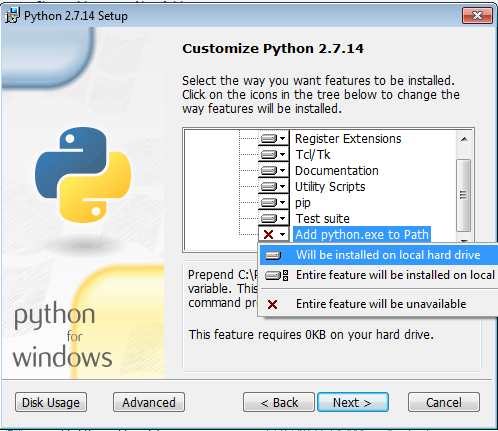
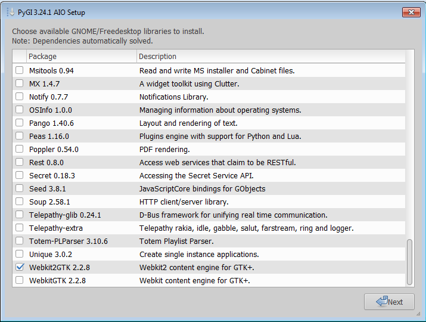

Installing on GNU/Linux
---
Requirements:

 - Gtk >= 3.12
 - Python Cairo bindings
 - Python Gobject Introspection
 - matplotlib
 - PySerial

On Debian/Ubuntu you can run `sudo apt-get install python3-gi python3-cairo python3-gi-cairo python3-serial python3-matplotlib`

Installing on Windows
---

Install [python 2.7](https://www.python.org/downloads/) (3.6 is currently not supported on windows)
 - Be sure to select `Add python.exe to path` during the installation



Install [PyObject for Windows (PyGI AIO)](https://sourceforge.net/projects/pygobjectwin32/)
 - Skip the portable python path (should recognize 2.7 automatically)
 - Be sure to select Webkit2GTK packages when asked to install GNOME libraries.



Run (once) `install_deps.bat`

Running on GNU/Linux
---

```
cd /path/to/undeRaspGUI
./main.py
```

Running on Windows
---

Run app via `main.bat`
